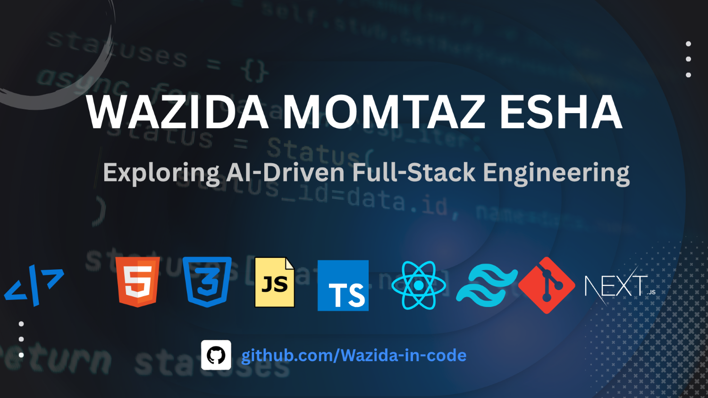

        
# 💫 Hi 👋, I'm Wazida Momtaz Esha

- 🌱 **I’m currently learning:** Web development & others

## 👋 About Me

Hi, I'm Wazida Momtaz Esha, I'm a passionate web development learner currently exploring AI-Driven Full-Stack Engineering. I enjoy building modern web applications and continuously learning new technologies.

- 🌱 I’m currently learning Next.js and TypeScript.
- ⚛️ I’m building projects with React.js and Next.js.
- 🤖 I’m exploring AI-driven development.
- 🚀 I’m working on improving my full-stack development skills.

## 🌐 Connect With Me

 
 

# 💻 Tech Stack:

### **Frontend**

### **Others Programming Language**
 

### **Tools & Others**

# 📊 GitHub Stats:
 
 

<!-- Snake Game Repo View -->

  

## 🏆 GitHub Trophies

### ✍️ Random Dev Quote

### 🔝 Top Contributed Repo

---

<!-- Proudly created with GPRM ( https://gprm.itsvg.in ) -->
